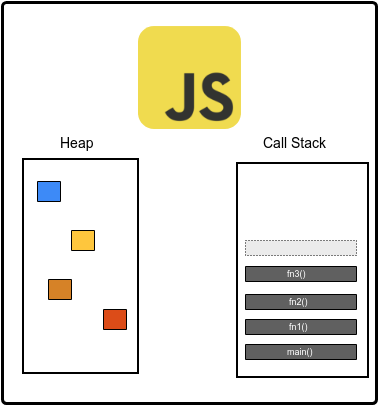

# Asynchronous Programming with Promises and Async/Await

This repo contains small exercises to get more accustom with two ways of dealing with asynchronous code in JavaScript: Promises and the new Async/Await syntax.

This repo contains four big chapters:

- [Chapter 0 - The Event Loop](#chapter-0---the-event-loop)
- Chapter 1 - Callbacks 
- Chapter 2 - Promises
- Chapter 3 - Async/Await

Each chapter contains exercises and questions which will walk you threw the journey from callbacks to Promises and Async/Await.

## Chapter 0 - The Event Loop

Before everything, we need to talk about JavaScript's asynchronous model, or how does asynchronous programming work in JavaScript.

The most important question we will answer: **Is JavaScript an asyncrhonous programming language?**

### JavaScript as a language

We all heard about [EcmaScript](https://www.ecma-international.org/ecma-262/8.0/index.html) right (or in it's other forms: *ES5*, *ES6*, *ES2015* etc.)? EcmaScript is the standard wich describes how the language should look and work. This is a very big document which contains every tiny little detail about the language: how objects intereact, what functions they should contain and how they should work etc.. This officla document is written so that future JavaScritp engines know how to be built. 

We all heard of JavaScript engines like: Chrome's [V8](https://developers.google.com/v8), Microsoft's [ChakraCore](https://github.com/Microsoft/ChakraCore) or Mozilla's [SpiderMonkey](https://developer.mozilla.org/en-US/docs/Mozilla/Projects/SpiderMonkey). These engines all follow the [EcmaScript](https://www.ecma-international.org/ecma-262/8.0/index.html) standard.

A JavaScript engine has two important internal parts:



- **Heap**: is the engine's memory where objects, functions etc. get allocated and managed
- **Call Stack**: because JavaScript is single threaded, it can do only one thing at a time. The call stack manages how functions get executed, in a *LIFO* kind of fashion.

For funsies, let's open the [EcmaScript standard](https://www.ecma-international.org/ecma-262/8.0/index.html) and search for a very common function like: `setTimeout`. It should be there right? 
No - we will not find that function in the document. Why you ask? The answer is pretty simple. JavaScript as a language, is a syncrhonous programming language. However, besides JavaScript engines there is another player we need to talk about, and that player is: **JavaScript Runtimes**.

A JavaScript runtime is a higher layer over the JavaScript engine which provides extra functionality like libraries, event loops etc. A few examples of runtimes are: Browsers (Chrome, Firefox etc.), NodeJS. A runtime may implement any engine it chooses. This is where the event loop is found, in the JavaScript runtime.

### What is the event loop?

The Event Loop is a runtime level implementation which offers asyncrhonous code running abilities:


## Chapter 1 - Callbacks
**Callbacks** are the most *low level*ish way of handling asyncrhonous code. A callback is a function passed as an argument to another function. The power of this pattern kicks in when combined with an asyncrhonous function:

```javascript
function foo(callback) {
	setTimeout(() => {
		callback()
	}, 1000);
}
```

### Error handling
We can also use callbacks to handle errors:

```javascript
function hello(success, failure) {
	setTimeout(() => {
		const chance = Math.ceil(Math.random() * 2);

		if (chance == 2) {
			success()
		} else {
			failure();
		}
	});
}

const succ = () => console.log('yay!');
const failure = () => console.log('I should not play the Loto');

hello(succ, failure);
```

## Chapter 2 - Promises


## Chapter 3 - Async/Await

## Bibliography:
1. [Eloquent JavaScript - Chapter 11: Asyncrhonous Programming](https://eloquentjavascript.net/11_async.html)
2. [MDN - Promise](https://developer.mozilla.org/en-US/docs/Web/JavaScript/Reference/Global_Objects/Promise)
3. [MDN - async function](https://developer.mozilla.org/en-US/docs/Web/JavaScript/Reference/Statements/async_function) 
4. [JSConf EU 2014 - Philip Roberts: What the heck is the event loop anyway?](https://www.youtube.com/watch?v=8aGhZQkoFbQ)
5. [Message Queue Wiki](https://en.wikipedia.org/wiki/Message_queue)
6. [MDN - Concurrency model and Event Loop](https://developer.mozilla.org/en-US/docs/Web/JavaScript/EventLoop)
7. [Alexander Zlatkov - How JavaScript works: an overview of the engine, the runtime, and the call stack](https://blog.sessionstack.com/how-does-javascript-actually-work-part-1-b0bacc073cf)
